# Corporate Network Security Assessment

> **Type:** Internal Network Mapping and Risk Analysis
> **Environment:** Virtualized (LinuxLite + Docker, 3 simulated networks)
> **Date:** July 2025
> **Author:** Évora da Ibéria Leite · [evoraleite@gmail.com](mailto:evoraleite@gmail.com)
> **Tools:** Nmap · RustScan · smbclient · enum4linux · MySQL CLI · Zabbix

---

## Table of Contents

- [Executive Summary](#executive-summary)
- [Objective](#objective)
- [Scope](#scope)
- [Methodology](#methodology)
- [Asset Inventory](#asset-inventory)
- [Findings and Evidence](#findings-and-evidence)
  - [1. Network Overview](#1-network-overview)
  - [2. infra\_net (10.10.30.0/24)](#2-infra_net-101030024)
  - [3. corp\_net (10.10.10.0/24)](#3-corp_net-101010024)
  - [4. guest\_net (10.10.50.0/24)](#4-guest_net-101050024)
- [Risk Summary](#risk-summary)
- [80/20 Action Plan](#8020-action-plan)
- [Annexes](annexes.md)

---

## Executive Summary

This document presents the corporate network mapping of the simulated environment and exposes the risks identified throughout the analysis.

Using established industry methodologies, three networks were found: `infra_net`, `corp_net`, and `guest_net`. The analyst machine had interfaces on all three networks.

**General network risks:**

- All three networks communicate with each other (critical risk)
- No DMZ exists to isolate servers that should face external traffic (critical risk)

**Main risks found in `infra_net`:**

- Servers are reachable from the guest network (critical)
- A legacy server runs on the same flat network (medium-high: legacy systems lack updates and security patches)
- Zabbix server with default credentials (login: `Admin`, password: `zabbix`) (high: any user on any network can access the monitoring system)
- MySQL database server with `root` password equal to the username (login: `root`, password: `root`) (critical: full database compromise is trivial)
- Samba server with anonymous access enabled (medium-high: password policy retrieved without credentials, enabling targeted brute-force)

**Risks in `corp_net`:**

- Corporate devices are reachable from the guest network

**Risks in `guest_net`:**

- Device hostnames expose owner identities, enabling social engineering attacks
- Two devices expose the hardware model in their hostname, enabling targeted exploit selection

---

## Objective

Analyze the simulated network to identify exposure, segmentation failures, and risks in the infrastructure and the systems running on it.

---

## Scope

Virtualized environment using LinuxLite with a Docker setup simulating three networks.

---

## Methodology

Using the `analyst` machine, initial reconnaissance of the network interfaces was performed with `ifconfig`, confirming which networks the machine was connected to. Connectivity between the switches was then tested bidirectionally using ping:

```bash
ping -c4 -I <switch-1-interface> <switch-2-interface>
```

This process was repeated until all interface pairs were tested in both directions, confirming whether cross-network communication was possible without a firewall.

To build the network map and confirm inter-network device communication, temporary IP addresses were assigned to the analyst machine's interfaces:

```bash
ip addr add <test-ip-on-switch-X-network> dev eth1
ip addr add <test-ip-on-switch-Y-network> dev eth2
```

Then pings were sent between the temporary IPs:

```bash
ping -c4 -I <test-ip-on-switch-X-network> <test-ip-on-switch-Y-network>
```

Successful pings confirmed flat routing with no firewall between segments. After mapping, temporary IPs were removed:

```bash
ip addr del <test-ip-on-switch-X-network> dev eth1
ip addr del <test-ip-on-switch-Y-network> dev eth2
```

Each network address range was then scanned with Nmap to discover live hosts:

```bash
nmap -sn -T4 <network-address>/<mask>
```

For each discovered host, RustScan was used to identify open ports and running services:

```bash
rustscan -a <ip1>,<ip2>,...,<ipN>
```

For hosts with open ports, default credential login was attempted:

- Default username + default password
- Common default usernames with the password equal to the username

---

## Asset Inventory

| Network | IPs | MAC Address | Device |
|---------|-----|-------------|--------|
| 10.10.30.0/24 | 10.10.30.10 | 7A:28:B1:0F:C7:35 | FTP Server |
| | 10.10.30.11 | 5A:3C:C8:CC:8B:84 | MySQL Server |
| | 10.10.30.15 | 6A:75:46:80:C0:1E | Samba Server |
| | 10.10.30.17 | 1E:9D:EC:AB:BD:D7 | OpenLDAP Server |
| | 10.10.30.117 | EA:3B:D2:C5:BD:0F | Zabbix Server |
| | 10.10.30.227 | 06:DA:AD:F0:BB:94 | Legacy Server |
| 10.10.10.0/24 | 10.10.10.10 | FE:76:D9:6A:2F:B0 | WS_001 |
| | 10.10.10.101 | 8E:B6:4E:86:DB:B4 | WS_002 |
| | 10.10.10.127 | EA:5A:DE:86:5F:70 | WS_003 |
| | 10.10.10.222 | AE:4F:64:D2:F3:AF | WS_004 |
| 10.10.50.0/24 | 10.10.50.2 | 7E:00:91:09:DC:0C | laptop-vostro |
| | 10.10.50.3 | 66:7F:CD:DB:04:E5 | macbook-aline |
| | 10.10.50.4 | C6:31:AB:FC:8D:BD | laptop-carlos |
| | 10.10.50.5 | 52:2E:B9:14:B6:C9 | laptop-luiz |

---

## Findings and Evidence

### 1. Network Overview

The `ifconfig` output on the analyst machine confirmed three active network interfaces, one per network segment:

- `10.10.30.0/24` (infra_net)
- `10.10.10.0/24` (corp_net)
- `10.10.50.0/24` (guest_net)

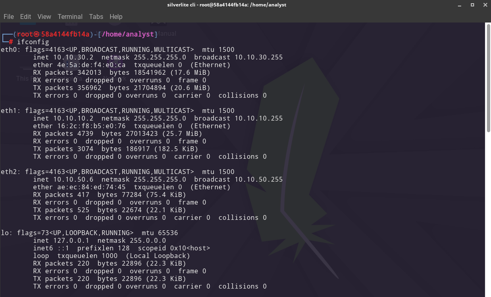

Ping tests between all segment pairs succeeded, confirming that devices across all three networks can communicate freely with no firewall in between. This is a critical finding.

#### 1.1 Network Diagram

The diagram below shows all discovered devices, their IPs, and the connections between the three network segments through the analyst machine.

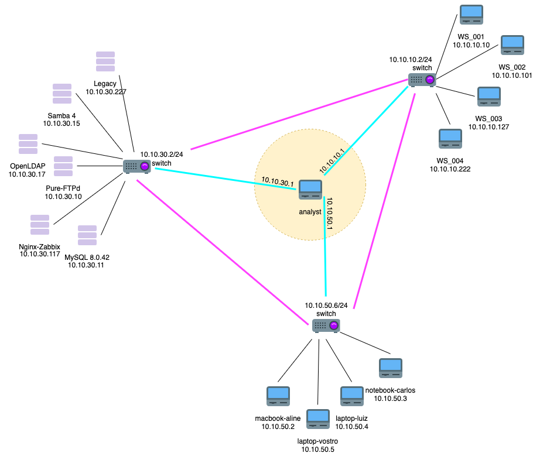

#### 1.1.1 Network-Level Risks

- Devices communicate freely across different network segments (no segmentation enforcement)
- No DMZ exists for servers that require external-facing exposure
- The monitoring server (Zabbix) is not isolated in its own segment
- The legacy server is not isolated
- The corporate network (`10.10.10.0/24`) should be a strictly internal segment
- The guest network (`10.10.50.0/24`) should be a fully external segment with no access to internal resources
- The ability to ping across segments using the methodology above confirms the network has no inter-segment firewall

---

### 2. infra\_net (10.10.30.0/24)

The Nmap host discovery scan returned six live IP addresses:

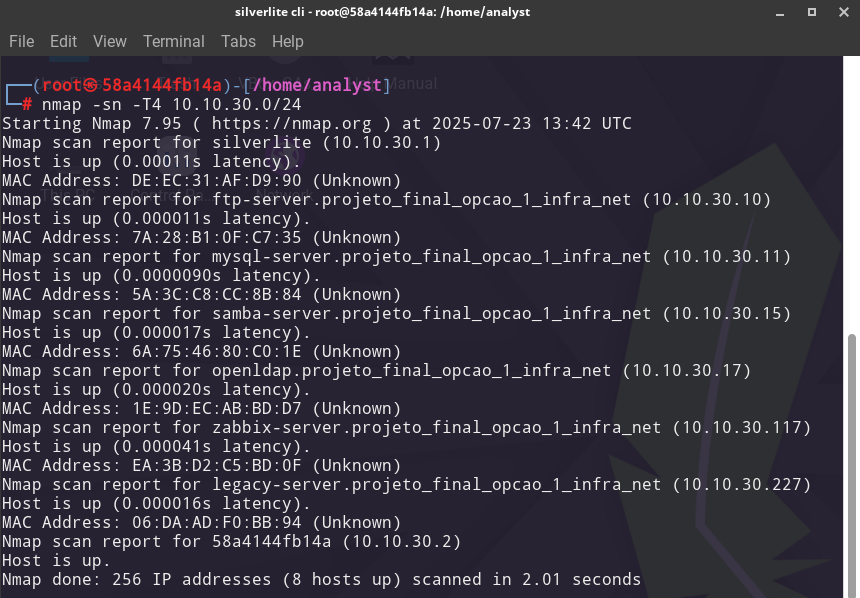

**Discovered devices:**

| IP | Device |
|----|--------|
| 10.10.30.10 | FTP Server (Pure-FTPd) |
| 10.10.30.11 | MySQL Server 8.0.42 |
| 10.10.30.15 | Samba Server 4 |
| 10.10.30.17 | OpenLDAP 2.2.x |
| 10.10.30.117 | Nginx + Zabbix |
| 10.10.30.227 | Legacy Server |

RustScan identified open ports across all hosts (except the legacy server, which returned no open ports):

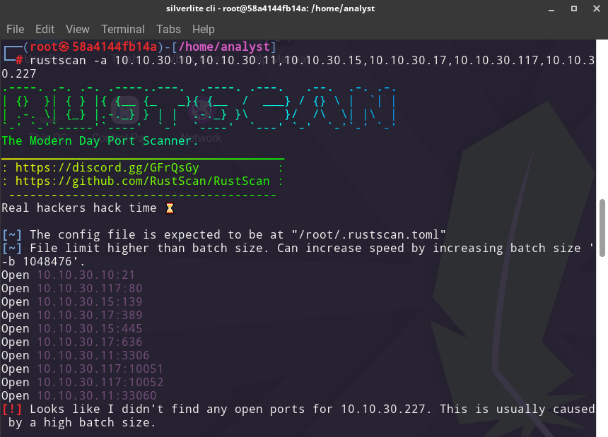

**Open ports and services:**

| Host / IP | Service | Port | Version |
|-----------|---------|------|---------|
| 10.10.30.10 | ftp | 21/tcp | Pure-FTPd |
| 10.10.30.11 | mysql | 3306/tcp | MySQL 8.0.42 |
| 10.10.30.11 | mysqlx | 33060/tcp | |
| 10.10.30.15 | netbios-ssn | 139/tcp | Samba 4 |
| 10.10.30.15 | microsoft-ds | 445/tcp | Samba 4 |
| 10.10.30.17 | ldap | 389/tcp | OpenLDAP 2.2.x |
| 10.10.30.17 | ldapssl | 636/tcp | OpenLDAP 2.2.x |
| 10.10.30.117 | http | 80/tcp | Nginx (Zabbix) |
| 10.10.30.117 | zabbix-trapper | 10051/tcp | |
| 10.10.30.117 | unknown | 10052/tcp | |

Detailed per-host scan outputs are available in [annexes.md](annexes.md).

---

#### 2.1 Risk: MySQL Server (10.10.30.11) — Critical

Login attempts on the MySQL server revealed that the `root` user has password equal to the username (`root:root`). This user holds full privileges on the entire database.

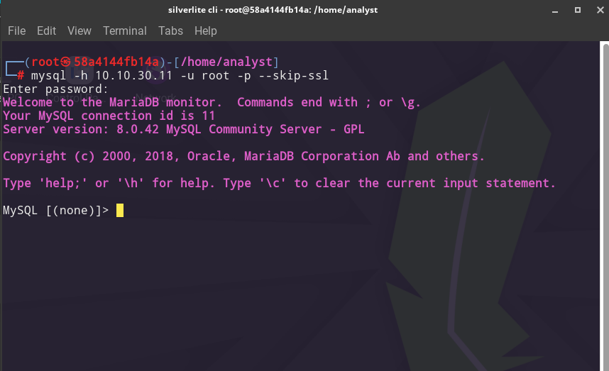

The `SHOW GRANTS` output confirms the `root` user has all possible privileges, including `GRANT OPTION`:

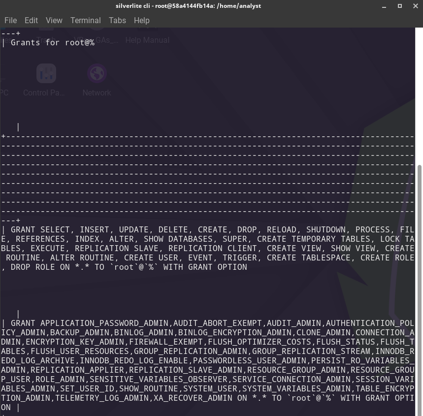

The user table was listed before any changes:

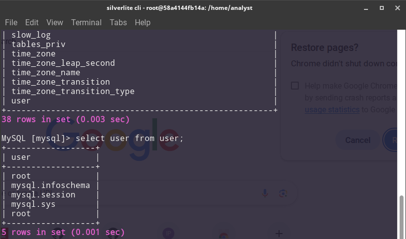

To demonstrate the full impact of this vulnerability, a new user named `hacker` was created with full privileges and remote access:

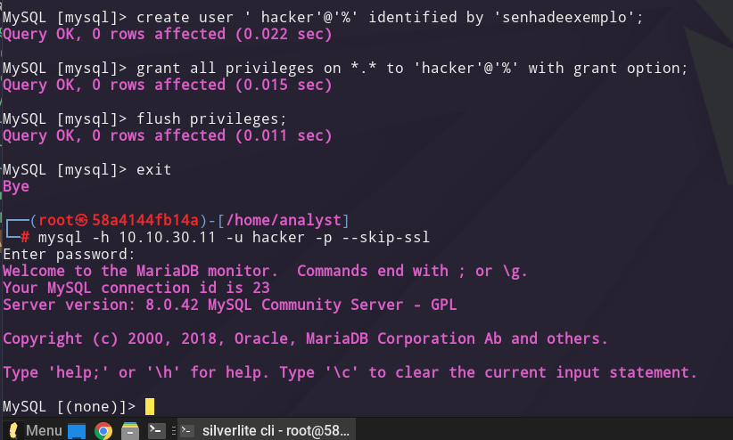

The user table after the test confirms the `hacker` account now exists alongside the original accounts:

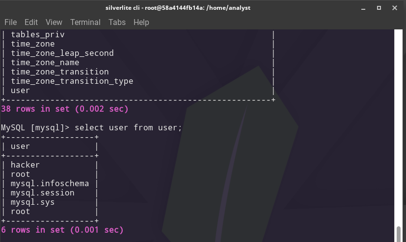

**Risk level: Critical.** The probability of exploitation is very high and the impact can be devastating for the organization across all dimensions of the CIA triad and compliance.

##### 2.1.1 Recommended Countermeasures

- Immediately change the `root` database password to a strong, unique credential
- Review all users with access to the server and remove unnecessary accounts
- Audit the database for unauthorized changes (new users, schema modifications, data exports)

---

#### 2.2 Risk: Samba Server (10.10.30.15) — Medium-High

Two ports are in use for the SMB protocol: `445` and `139`. Port 445 is the current recommended port; port 139 is associated with older, vulnerable NetBIOS implementations that rely on legacy protocols.

Anonymous login to the Samba server was successful. No shared folders were visible, but the connection itself was established without credentials:

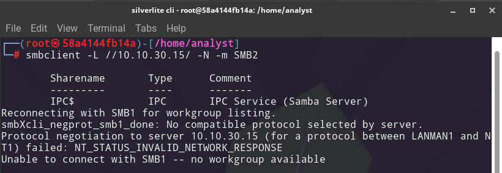

The `enum4linux` tool retrieved the server's password policy without authentication. The result shows password complexity is disabled and the minimum password length is only 5 characters:

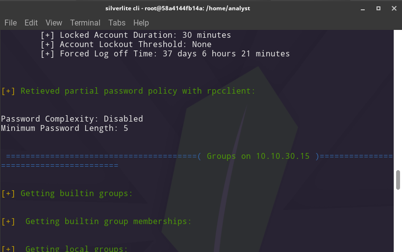

**Risk level: Medium-High.** Because the Samba server has access to `guest_net`, a malicious actor connected to the guest network could use the retrieved password policy to optimize a brute-force attack against this server.

##### 2.2.1 Recommended Countermeasures

- Identify all devices running legacy NetBIOS and update them to use port 445 only
- Enable password complexity requirements
- Move the Samba server into a DMZ

---

#### 2.3 Risk: Nginx/Zabbix Server (10.10.30.117) — High

The Zabbix monitoring server accepts login with default credentials (`Admin` / `zabbix`). Despite being on an internal IP, this server is not in an isolated VLAN as a monitoring server should be.

Because the server is reachable from all three network segments, any individual connected to any network (including guest) can access the Zabbix dashboard. The consequences include:

- Full visibility into the network topology and device status
- Ability to manipulate monitoring logs and alerts to cover malicious activity (for example, an attacker could execute a DoS/DDoS attack and suppress the corresponding alerts in Zabbix to delay detection)

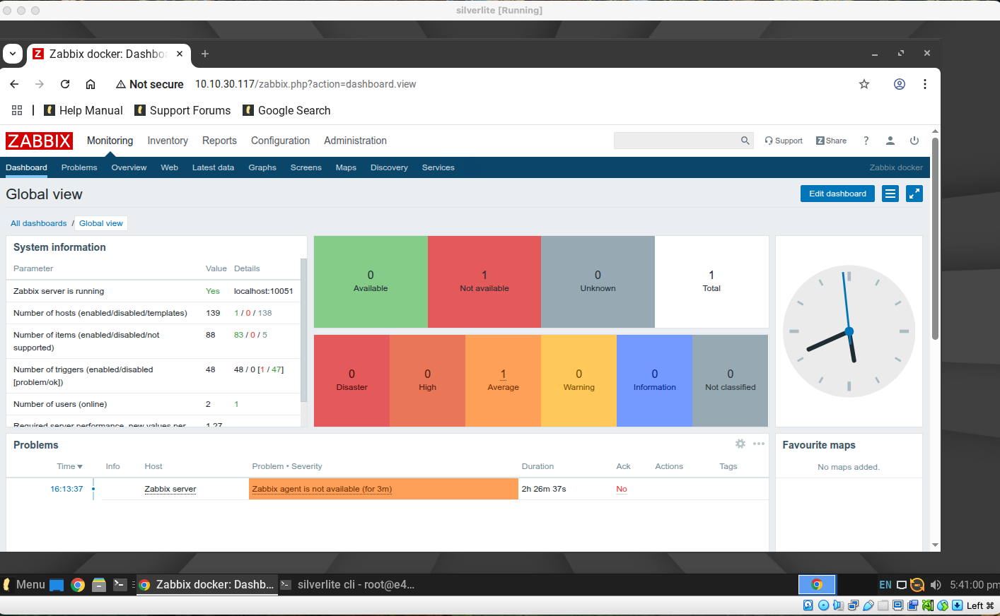

**Risk level: High.**

##### 2.3.1 Recommended Countermeasures

- Immediately change the admin password
- Review all users with access to the Zabbix instance
- Implement MFA for Zabbix login

---

#### 2.4 Risk: Legacy Server (10.10.30.227) — Medium-High

No open ports were found on this device. However, the hostname identifies it as a legacy server. Legacy systems are by definition out-of-date and unpatched, making them vulnerable to known exploits. Their presence in the same flat network as production servers enables lateral movement after an initial compromise.

##### 2.4.1 Recommended Countermeasures

- Update the system; if that is not feasible, isolate it using VLANs or place it in a dedicated DMZ
- Determine the purpose of this server before deciding on the best course of action

---

### 3. corp\_net (10.10.10.0/24)

The Nmap scan returned four live devices. RustScan found no open ports on any of them.

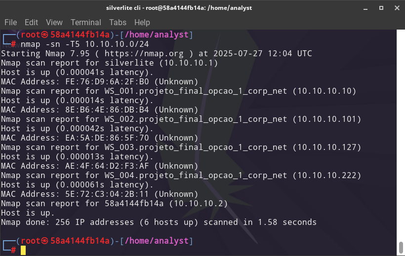

#### 3.1 Risks

The corporate network should be a strictly internal segment, fully isolated from both `guest_net` and `infra_net`. As it stands, it is reachable from the guest network. The risk is medium: a social engineering attack could lead to physical access to a corporate machine, enabling malware installation that spreads laterally into the infrastructure network.

##### 3.1.1 Recommended Countermeasures

- Place `corp_net` in an isolated internal segment with no direct route to `guest_net` or `infra_net`

---

### 4. guest\_net (10.10.50.0/24)

The scan returned four live devices. No open ports were found on any of them.

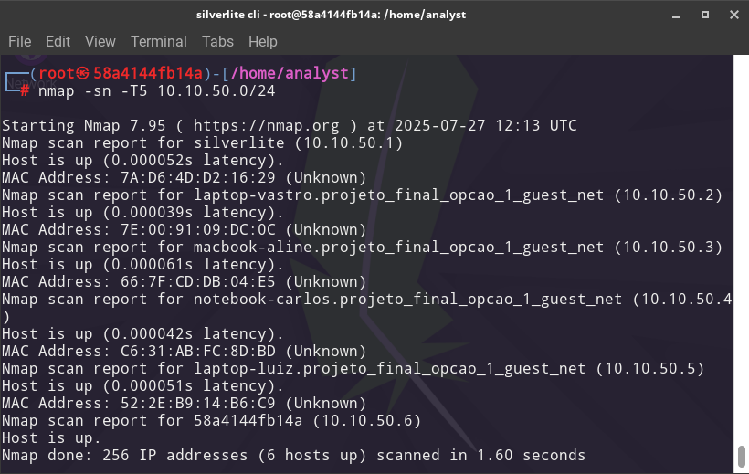

#### 4.1 Risks

This network has unrestricted access to both other networks. It should be a fully external segment because it consists of unmanaged personal devices with no institutional controls. As configured, it is a strong candidate for use as an attack entry point.

##### 4.1.1 Recommended Countermeasures

- Reconfigure as an external network with no routing access to `infra_net` or `corp_net`
- Implement a login portal for guest network access to enable user tracking

#### 4.2 Specific Risks

- **10.10.50.2 (laptop-vostro):** The hostname reveals the hardware model, enabling an attacker to select firmware-specific exploits or targeted malware
- **10.10.50.3, 10.10.50.4, 10.10.50.5:** Hostnames expose the first names of the device owners, enabling targeted social engineering attacks

##### 4.2.1 Recommended Countermeasures

- Rename all devices to generic, non-identifying names
- Avoid names that reveal gender, as attackers may specifically target profiles they perceive as more vulnerable

---

## Risk Summary

| Action | Problem | Risk | Impact | Ease | Priority |
|--------|---------|------|--------|------|----------|
| Isolate guest_net from all other segments | All networks communicate freely; guest users can reach critical servers | Critical | High | High | **High** |
| Create a DMZ for externally exposed servers | Servers are directly exposed with no buffer zone | Critical | High | Medium | **High** |
| Change database root password | MySQL root:root; unauthorized access, data manipulation, privilege escalation | Critical | High | High | **High** |
| Change Zabbix default credentials | Admin/zabbix; unauthorized access, log manipulation, attack concealment | High | High | High | **High** |
| Disable Samba anonymous access and enforce password complexity | Anonymous enumeration of password policy; passwords with no complexity | Medium-High | Medium | Medium | **Medium** |
| Update NetBIOS to port 445 only | Legacy NetBIOS protocol in use on port 139 | Medium-High | Medium | Medium | **Medium** |
| Isolate legacy server in VLAN or DMZ | Unpatched system with known vulnerabilities; enables lateral movement | Medium-High | Medium | Medium (isolation) / Low (migration) | **Medium** |
| Isolate corp_net from guest_net with ACLs or firewall | Corporate devices reachable from unmanaged guest devices | Medium | Medium | High | **High** |
| Rename guest_net devices with generic hostnames | Hostnames expose owner identities and hardware models | Medium | Medium | High | **Medium** |
| Deploy basic IDS/IPS or firewall anomaly detection rules | No detection for scans, brute-force attempts, or unusual traffic | Medium-High | High | Low | **Medium** |

---

## 80/20 Action Plan

Three actions fix the majority of critical risks with the highest return per effort:

| Action | Risks Addressed | Impact | Ease | Priority |
|--------|----------------|--------|------|----------|
| Full network isolation and DMZ implementation | Networks communicating freely; guest access to critical servers; servers exposed without a buffer zone | High | Medium | **High** |
| Remove all default credentials and enforce password complexity (Zabbix, MySQL, Samba) | Unauthorized access; data manipulation; log tampering; privilege escalation; anonymous policy enumeration | High | High | **High** |
| Isolate the legacy server in a VLAN | Reduces the risk of network-wide compromise through a known-vulnerable unpatched system | High | Medium | **High** |

---

*Detailed per-host scan outputs: [annexes.md](annexes.md)*
