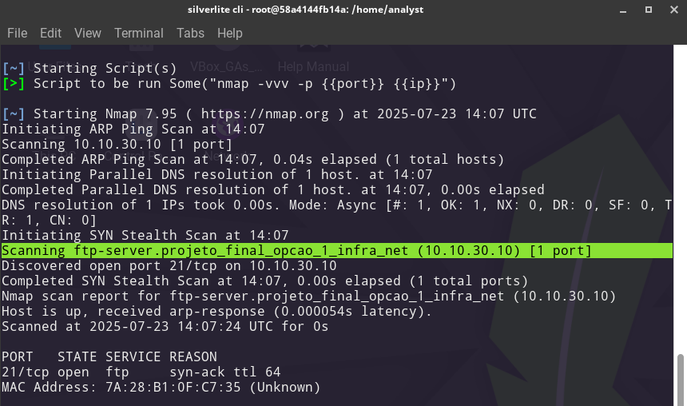
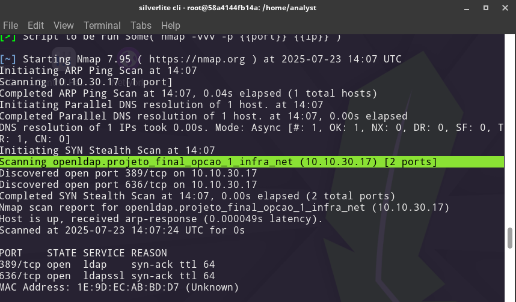
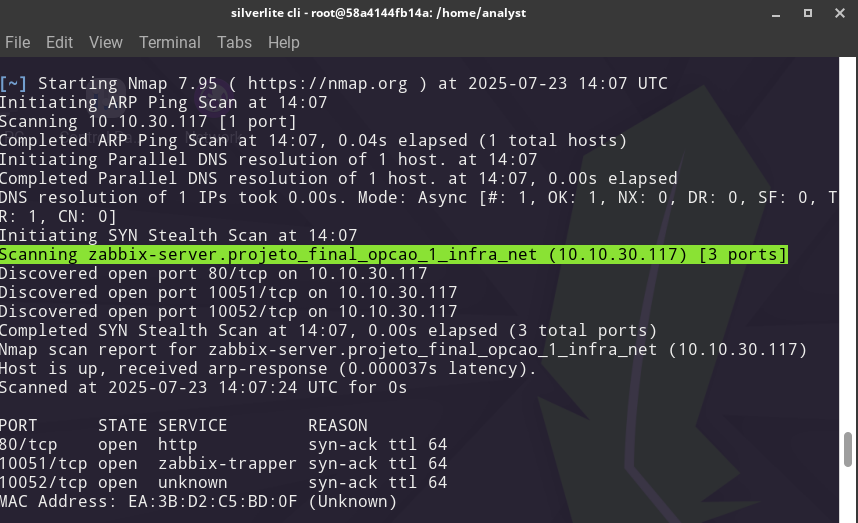
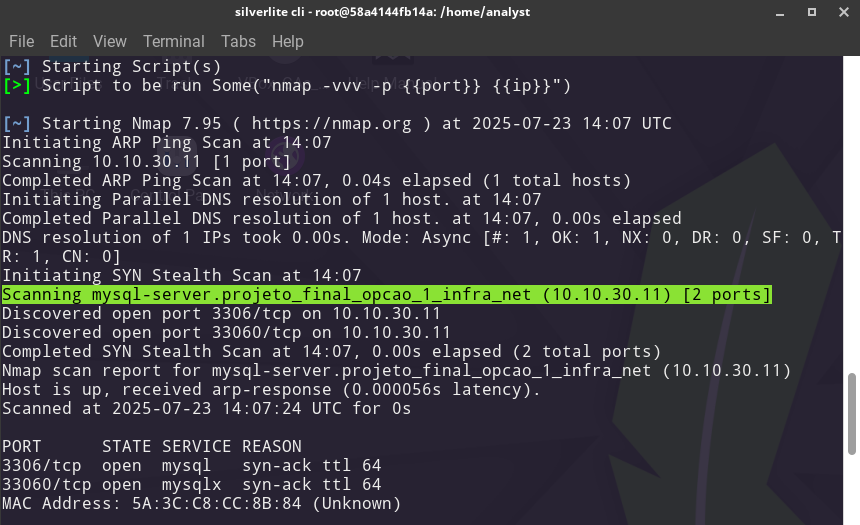

# Annexes: Detailed Per-Host Nmap Scans

> These are the full per-host stealth scan outputs (`nmap -vvv -p <port> <ip>`) run against each service identified by RustScan. TTL values of 64 confirm Linux operating systems across all hosts.

---

## infra_net Host Scans

### FTP Server (10.10.30.10) — Port 21/tcp

---

### OpenLDAP Server (10.10.30.17) — Ports 389/tcp and 636/tcp

---

### Zabbix/Nginx Server (10.10.30.117) — Ports 80/tcp, 10051/tcp, 10052/tcp

---

### infra_net Full Stealth Scan Summary

---

*Back to [README.md](README.md)*
